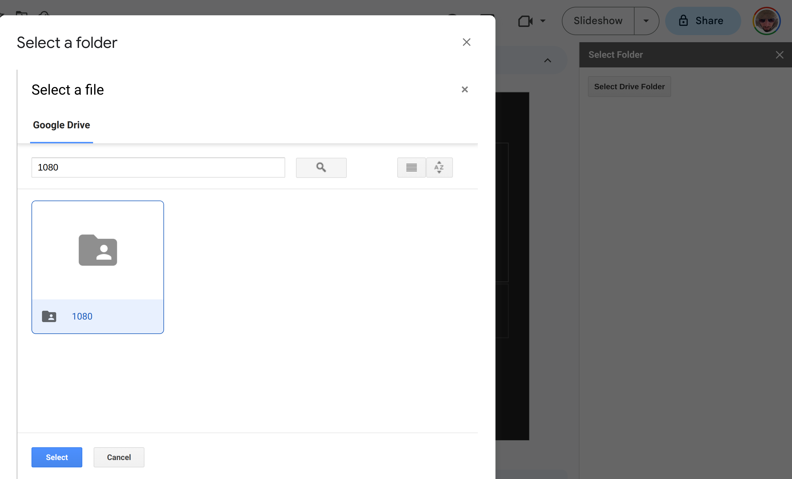
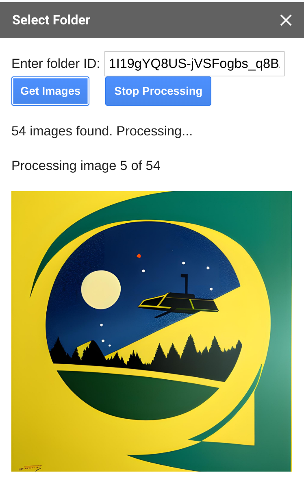

## CreateSlidesFromDriveFolder

A Google Slides Editor Add-on that reads all images in a Google Drive folder and creates a slide for each image in the current presentation

This repo demonstrates AppsScript's ability to automate repetetive tasks, such as creating a Slides portfolio from an images folder.

### Updates

#### Version 0.1.1 - Breaking changes

- Breaking change: Requires a GCP project, API key, OAuth client details
- Major feature: Select Drive folder using a Picker dialog. Uses the Picker API and intercom.js. 
- Generate Slides button appears only after a Drive folder has been selected
- Slide generation can be interrupted by user
- Added JSDoc to all functions



#### Version 0.0.2

- Sidebar updated with status and with each image
- Image slides are created one at a time
- Script picks up both PNG and JPG files
- Sidebar styling improved a bit (Using Google Workspace standard CSS)




#### Version 0.0.1

- Editor add-on
- Sidebar menu item
- Type Drive folder id and submit
- Logging to Script console
- Creates image slides from PNGs

### Develop

Clone this repo. This goes without saying, right?!

Make sure you have node.js (and npm naturally installed on your development system)

You are going to need the Clasp CLI in order to work with this project. 

**Install Clasp globally**

```bash
$ npm install -g @google/clasp
```

**Create a Clasp project**

Pay attention, the project must be in the src folder, not the root!

```bash
$ cd src
$ clasp login
$ clasp create CreateSlidesFromDriveFolder
$ clasp push
$ clasp open
```

This will open your browser and you should see the code from the src folder in the Google Script editor

**IMPORTANT: Never edit the code in the online editor, only in your local development environment**. We will be using Clasp to push code modifications from local development environmnent to the online testing environment. 

#### Test your code in Google Script & Slides

Before you begin, create a new Slides docuemnt for testing purposes on https://slides.new . Name your presenation for easy identification

Now that your code is online, you have to create a test in the online editor

- Press the arrow on the Deploy button
- Select Text Deployments
- Press the settings icon next to Select type (top left of the dialog)
- Select Editor Add-on
- Use the default settings, select the presentation you created for testing purposes
- Approve your settings
- Select the test from the list and press Execute. The presentation will open
- Open the Extensions menu. Your add-on should have a subment on it. 
- Test

**How to create a GCP project and get an API key and OAuth client id and secret**

Since version 0.1.1, Drive folder selection is done visually, thanks to the Picker API. In order to use this API, you need a GCP project. Please collect the various details related to your GCP project. We are going to use them in our Script project.

1. **Create a new GCP project**

Open the Google Cloud Console menu and select Create a Project. 

Full Google documentation details here: https://developers.google.com/workspace/guides/create-project

- Open the menu -> Cloud overview -> Dashboard
- Copy your project number and save it in a text editor. We are going to use it later

2. **Enable the Picker API (+Drive API, Slides API)**

- On the menu, open Enable APIs & Services
- Press the ENABLE APIS AND SERVICES button at the top
- Search for Google Picker API
- Press the result
- Enable it

Do the same for Drive API and Slides API

3. **Get an API key**

Assuming you are already in Google Cloud console:

- Open the menu and select APIs & Services -> Credentials
- Click CREATE CREDENTIALS > API key
- Your new API key is displayed. Click copy. Save this API key for later use in your project.
    - You many want to restrict your key: Website restrictions: *.google.com and *.googleusercontent.com
    - Restrict the Key to the Picker API

4. **Get an OAuth client**

- Open APIs & Services -> Credentials again
- Click CREATE CREDENTIALS > OAuth Client Id
- Application type: Web application
- Name: CreateSlidesFromDriveFolder
- Authorised Javascript Origins: https://docs.google.com
- Authorised redirect URIs: https://script.google.com/macros/d/{Your-script-id}/usercallback , where your-script-id is your AppsScript project ID, which you can extract from the Script editor URL
- Save it
- Copy the Client id an client secret details

5. **Define your GCP project, API key and OAuth client details in the Script project **

- Open your Script project. Form the command line in /src it is just clasp open
- Go to the settings panel
- In the Google Cloud Project section, press Change project and past your GCP project number
- In the Script Properties section, press Edit Script properties and add the following 3 properties:
    - API_KEY
    - CLIENT_ID
    - CLIENT_SECRET

The names are self explanatory. Save. 

That's it, your project is now using your own GCP project and has an API key and Client id and secret defined. These will be used by the code (v0.1.1 and above) for the Drive folder picker functionality. 

**How to manually get a folder id - Up to version 0.0.2**

Each folder in Google Drive has a unique ID. Just copy the id after the /folders/ part of the URL. For example, if the folder URL is https://drive.google.com/drive/folders/1I19gYQ8US-jVSFogbs_q8BZjcCu4PkCC, the id is 1I19gYQ8US-jVSFogbs_q8BZjcCu4PkCC

#### Add features and use Clasp to push to your testing environment

You coding is done in the local development machine from now on. Testing is done online though, so here is how to push your code and test.

- Edit the code in the src folder
- Save
- Open a terminal in the src folder

```bash
$ clasp push
$ clasp open
```

- Run your test deployment
- Test
- Close the Slides editor
- Repeat

## License - AGPLv3

This software is licensed under the AGPLv3 open-source license attached to this repo. It uses the Intercom.js library, which is licensed under the Apache 2.0 open-source license

CreateSlidesFromDriveFolder - A Google Slides Editor Add-on that reads all images in a Google Drive folder and creates a slide for each image in the current presentation
Copyright (C) 2023  Asaf Prihadash TailorVJ.com